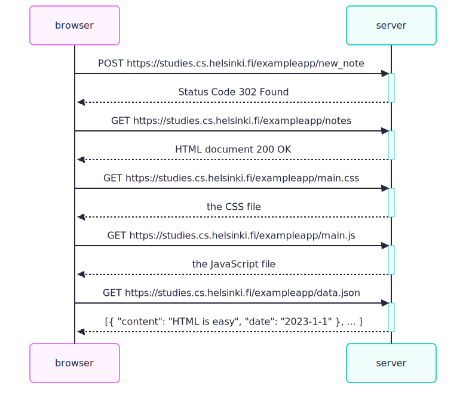
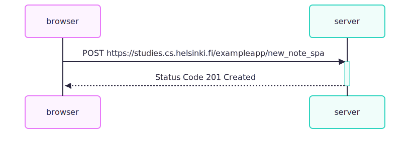

# NOTES

## 0.4: New note diagram

## 0.5: Single page app diagram

<pre class="vditor-reset" placeholder="" contenteditable="true" spellcheck="false">

</pre>

## 0.6: New note in Single page app diagram

